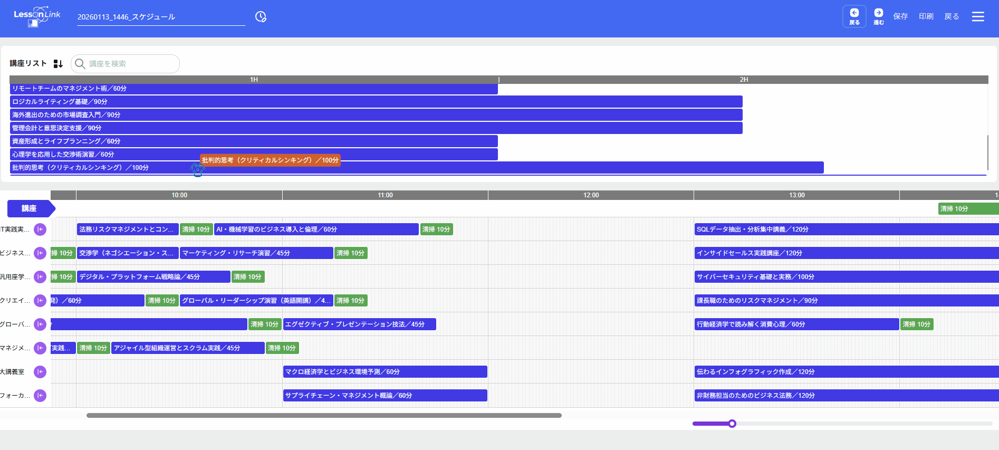
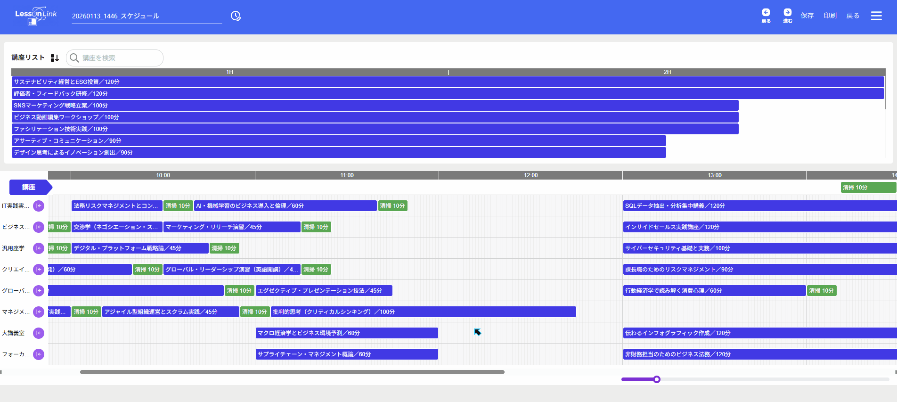
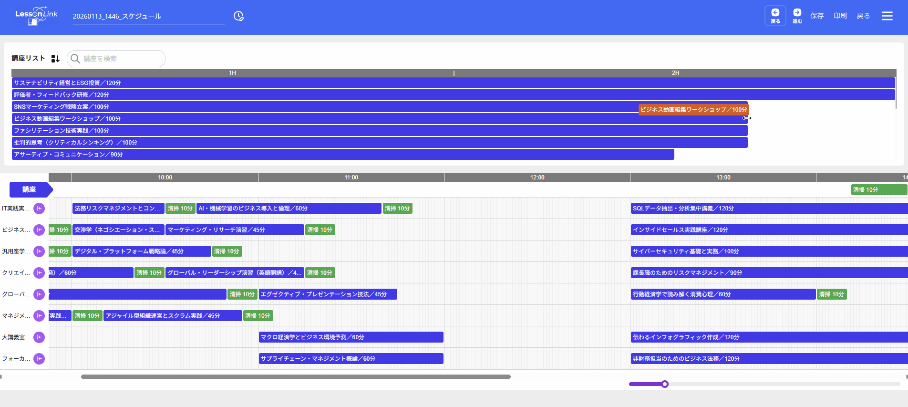
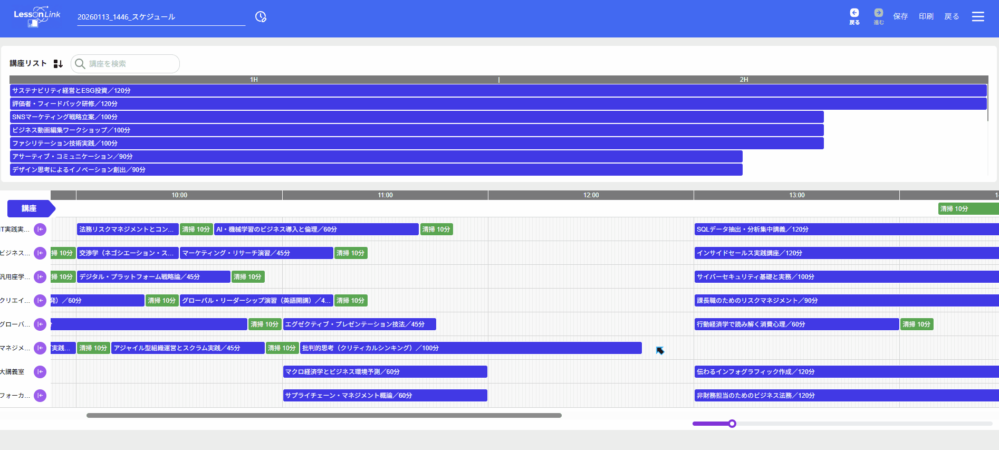
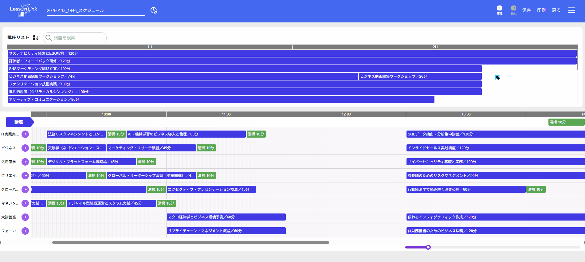
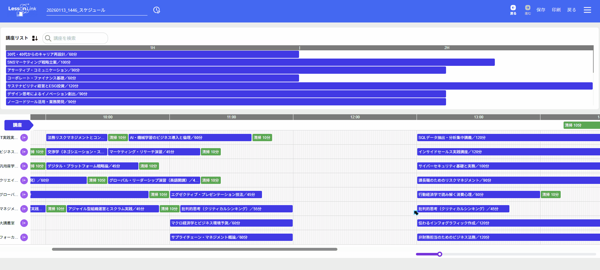

## プロジェクト概要

本プロジェクトは、**講座と教室の割り当てを行うシステム**のフロントエンド実装です。  
ユーザー管理・講座管理・スケジュール作成の機能を備え、業務で作成したシステムをもとに個人で再構築しています。

Next.js と TypeScript を用いて実装しており、バックエンドとは自作の Go アプリケーションを連携させています。  
Swagger（swaggo）で生成された API 定義をもとに、**zod-client** によりエンドポイントを自動生成しています。

本プロジェクトは **学習およびポートフォリオ目的**で開発しており、今後も継続的にアップデートを行う予定です。  
フロントエンド初心者として、まずは UI が意図したとおりに動作・表示されることを重視しています。

## 画面キャプチャ
<figure>
  <figcaption>講座の移動</figcaption>
  
  
</figure>

<figure>
  <figcaption>講座の分割</figcaption>
  
  
</figure>

<figure>
  <figcaption>講座の結合</figcaption>
  
  
</figure>

## 使用技術（Tech Stack）

| 分類 | 使用技術 |
|------|------------|
| フレームワーク | Next.js (React, TypeScript) |
| スタイリング | Tailwind CSS |
| コード品質 | Biome |
| API クライアント | zod-client（Swagger 生成の型定義を使用） |
| API ドキュメント | swaggo / Swagger UI |
| その他 | Node.js, npm, Git, GitHub |

## プロジェクト構成（Directory Structure）
```
frontend/
├── src/
│   ├── app/              # Next.js App Router（ページおよびルーティング）
│   ├── context/          # グローバル状態管理・Context API定義
│   └── generated/        # zod-client により Swagger から自動生成された型・APIクライアント
├── public/                # 静的ファイル（画像・SVGなど）
│   └── images/
├── docs/                  # ドキュメント用（README画像など）※任意で作成
├── cloudbuild/            # Cloud Build 設定（デプロイ用）
│   └── prod/
├── styles.ts              # Tailwind 等のスタイル設定
├── tailwind.config.ts     # Tailwind CSS 設定ファイル
├── postcss.config.mjs     # PostCSS 設定
├── biome.json             # Biome 設定ファイル
├── next.config.(js|mjs)   # Next.js 設定
├── tsconfig.json          # TypeScript 設定
├── package.json           # npm パッケージ定義
├── open-api.json          # Swagger 定義（バックエンド連携用）
└── swagger.yaml           # swaggo 生成元のAPIスキーマ
```

## ディレクトリ構成の考え方（構成ポリシー）

本プロジェクトは **Next.js App Router** をベースに構成されています。  
`src/app/` 以下はページ単位で整理し、機能的に関連する画面を `(authorized)` ディレクトリ配下にまとめています。  

- `src/app/`：App Router のエントリ。`layout.tsx` と `page.tsx` を含むルート構成  
  - `(authorized)/`：ログイン後の機能画面をまとめたセクション  
    - `campus-select/`, `lesson-edit/`, `room-edit/`, `schedule-list/`, `time-schedule/`, `user-list/` などの各機能ディレクトリ  
  - `_components/`：共通UI・定数定義（例：`Constants.tsx`, `indicator`）  
  - `lib/`：環境変数・通知・ユーティリティ・API クライアント設定などの共通ロジック  
  - `providers/`：グローバルプロバイダ（例：`MuiProvider.tsx`）  
  - `login/`：ログイン画面および関連コンポーネント  
- `src/context/`：全体共通の状態管理（例：ユーザー情報）  
- `src/generated/`：Swagger 定義から zod-client により自動生成された API クライアントと型定義  

### 設計方針

1. ページ単位の構成を基本とし、再利用可能なUI・ロジックは `_components/` と `lib/` に分離  
2. 認証後の画面は `(authorized)` 以下に集約して責務を明確化  
3. API通信は `generated` 配下の型安全なクライアントを利用  

## API 通信設計

本プロジェクトでは、バックエンド（Go製API）との通信を **Swagger 定義** を基に自動生成しています。  
API スキーマは `swagger.yaml` および `open-api.json` に保持され、  
`zod-client` により型定義とクライアントコードを `src/generated/` 配下に生成します。

### 構成概要

- `swagger.yaml`：バックエンド（swaggo）によって生成されたAPI仕様書  
- `open-api.json`：OpenAPI形式に変換された同一仕様  
- `src/generated/`：`zod-client` により自動生成された型・APIクライアント  
- `src/app/lib/zodios.ts`：Zodios クライアント設定とAPIエンドポイント初期化

### 通信方式

- **HTTP クライアント**：`zodios`  
- **バリデーション**：`zod` によるリクエスト／レスポンス型安全化  
- **エンドポイント生成**：  
  Swagger → `openapi-zod-client` → `src/generated/` → `Zodios` 経由で呼び出し  

### 設計方針

1. API仕様を単一ソース（Swagger）に集約し、型定義を自動生成で維持  
2. バックエンド更新時は再生成のみで同期可能（手動更新不要）  
3. 各ページでは `lib/zodios.ts` 経由でAPI呼び出しを行い、コードの重複を排除

## インストール手順

### 前提条件
- Node.js 18 以上  
- npm または pnpm が利用可能であること  

### セットアップ手順
```bash
# 依存関係のインストール
npm install
```

## 開発サーバ起動方法

```bash
# 開発環境の起動
npm run dev

# 起動後のアクセス
# ブラウザで以下のURLを開く
http://localhost:3031

# ビルド
npm run build

# 本番サーバ起動（ビルド後）
npm start
```

## 今後の展望

- フロントエンドのアーキテクチャ理解を深めるため、設計と実装の関係を意識したリファクタリングを進める。  
- パラメーターの受け渡しや状態管理が複雑化している部分を整理し、可読性を高める。  
- コンポーネント分割の粒度を見直し、責務の境界を意識した構成へ改善する。  
- コード全体を通して構造的な理解を進め、保守性と拡張性の向上を目指す。  
- 学習を継続し、初級者から中級者へ成長できるよう取り組んでいく。


## ライセンス

本リポジトリの内容は著作権により保護されています。  
無断での利用・再配布・改変を禁止します。

